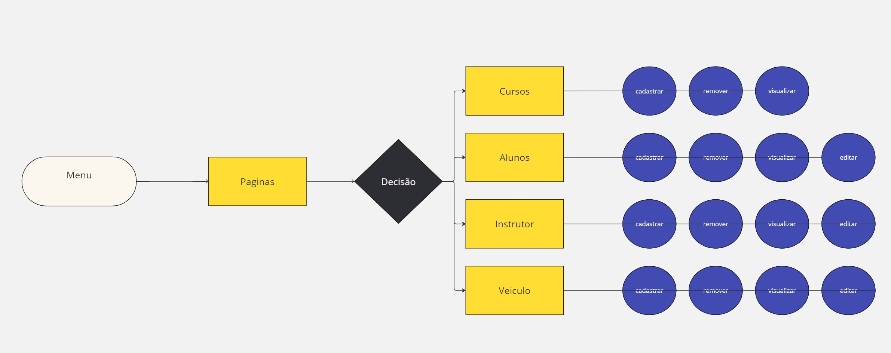

<b><h1>Escopo:</h1></b>

    O sistema de gerenciamento da autoescola será uma aplicação desktop desenvolvida em Java utilizando a biblioteca Swing para a interface gráfica. O sistema terá as seguintes funcionalidades principais:

<b>Cadastro de Alunos:</b> Permitir o registro de dados pessoais e informações sobre a habilitação.

<b>Cadastro de Instrutores:</b> Registro de informações dos instrutores, incluindo disponibilidade.

<b>Gerenciamento de Veículos:</b> Registro e controle de veículos da autoescola.

<b>Gestão Financeira:</b> Controle de pagamentos, recebimentos e relatórios financeiros.

<b>Relatórios:</b> Geração de relatórios de desempenho de alunos.

<b><h1>Objetivo SMART</h1></b>

<b>Específico:</b> Criar um sistema de gerenciamento para autoescolas que centralize as informações de alunos, instrutores e agendamentos.

<b>Mensurável:</b> O sistema deverá gerenciar até 200 alunos, 20 instrutores e 10 veículos com pelo menos 5 relatórios gerados mensalmente.

<b>Atingível:</b> A equipe de desenvolvimento, composta por 3 desenvolvedores experientes, está capacitada para realizar o projeto dentro do prazo estipulado.

<b>Relevante:</b> O projeto visa aumentar a eficiência da autoescola, reduzindo erros administrativos e melhorando a satisfação dos alunos.

<b>Temporal:</b> O desenvolvimento deverá ser concluído em 4 meses, com entregas parciais a cada 2 semanas.

<b><h1>Tecnologias:</h1></b>

Linguagem:Java  
Framework de gerenciamento: Maven 
Banco de Dados: PostgreSQL 
Interface Gráfica: Swing

Servidor para banco de dados (PostgreSQL) 
Ambiente de desenvolvimento (Visual Studio)  
Ferramentas de versionamento (Git)

<b><h1>Análise de Risco</h1> </b>
<b>Risco de Escopo:</b>  Mudanças nos requisitos podem atrasar o projeto.

<b>Mitigação: </b>  Documentar requisitos claramente e realizar revisões regulares com stakeholders.

<b>Risco Técnico:</b>  Dificuldades na integração entre componentes do sistema.

<b>Mitigação:</b>   Realizar testes de integração desde o início e criar documentação técnica detalhada.

<b>Risco de Prazo:</b>   Atrasos na entrega de módulos.

<b>Mitigação:</b>   Estabelecer prazos intermediários e realizar reuniões semanais de acompanhamento.

<b>Risco Financeiro:</b>   Orçamento excedido.

<b>Mitigação:</b>   Monitorar gastos mensalmente e ajustar conforme necessário.

<b>Risco de Qualidade:</b>  Falta de testes adequados pode levar a falhas no sistema.

<b>Mitigação:</b>   Incluir testes automatizados e manuais no processo de desenvolvimento.# SomativaJava

<b><h2>Diagrama de Classe</h2></b>

<b><h2>Diagrama de Fluxo</h2></b>

<b><h2>Diagrama de uso</h2></b>

<h3><a href="/Manual do Usuário.pdf">Manual do Usuario</a> </h3>